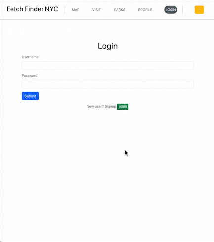
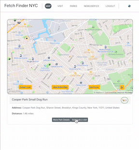

# FetchFinder NYC

  
FetchFinder is an app that assists dog owners in discovering nearby dog parks. The app provides a list of dog parks in the proximity and offers ratings and feedback by other users. It also offers data regarding the number of dogs in each park at any moment.
  

## Features
  
- User authentication: users can securely log in and out of their accounts.

- Profile Creation.

- Location Based Search: Allows user to search for dog parks based on their current location through geolocation and a map interface.

- Check-ins: allows users to check in to dog parks and obtain the current number of users checked in.
- User comments and images: allows users to leave comments and upload images for each dog park.

  

## Description

LOGIN/SIGNUP

  

The system enables user authentication and account creation for a personalized experience.

  

MAP

The user interface features an interactive map showcasing all dog parks located in New York City (NYC). Users can zoom in and navigate the map freely, with a convenient "view entire map" button provided for easy zooming out. Additionally, users can geolocate themselves by clicking on the pin button, resulting in a red "X" marking their current location on the map.

  

Upon geolocation and park selection, the map interface dynamically updates with additional buttons and a park blurb below:

  

Additional buttons include:

-   "Closer Look" button: Provides a zoomed-in view of the selected park, displaying the park's perimeter and area to offer a better understanding of its size and shape.
    
-   "Get Route" button: Generates the optimal route between the user's current location and the selected dog park.
    
-   "Globe" button: Zooms in on the user's current location.
    

Park Blurb: The park blurb offers brief details about the selected park, including:

-   Park name
    
-   Number of current park users checked in
    
-   Park address
    
-   Distance from the user's location
    
-   Options to navigate to "view more details" and "schedule a visit"
    

  

VISIT

Clicking the "Schedule a visit" button directs the user to a new visit form. The form is prefilled with the selected park's information and automatically sets the date and time to the current moment. Users can edit any of this information and input an estimated duration for their park visit. Submitting the form creates a visit and redirects the user to the "My Visits" section within the Visits tab. From there, users can edit or delete any future scheduled visits.

  

PARKS

  

The Parks tab provides comprehensive information on all dog parks in NYC. Each park is represented as a card containing the following details: park name, borough, number of users checked in, address, distance from the user's location, user-uploaded images, a comment section, the ability to upload additional images, navigation to the map, and the option to schedule a visit. Users can sort the parks alphabetically or in reverse order. If the user has geolocated, they can also sort the parks based on distance. Furthermore, a search feature allows users to find parks by name.

  
  
PROFILE

The Profile tab displays the user's image and username. It offers options to modify the user's profile image or username. Additionally, users can delete their account directly from this tab.

  